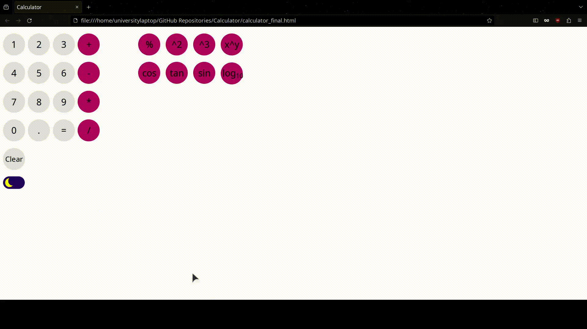

# Calculator Project

## Introduction
This project is a simple, yet powerful web-based calculator designed to perform basic arithmetic operations. It's built using HTML, CSS, and JavaScript, ensuring a user-friendly interface and a responsive design suitable for various devices.

## Screenshots
Below are screenshots of the calculator in action:

*Updated Version:*

## Usage

### Running the Calculator Online
To use the calculator, simply visit the following link:
[Calculator](https://aspasia-politou.github.io/Calculator/calculator_final.html)

This will take you directly to the hosted calculator, where you can start performing calculations immediately.

### Running the Calculator Locally
If you prefer to run the calculator on your local machine:
1. Download the ZIP file from the GitHub repository.
2. Extract the contents of the ZIP file to a desired location on your computer.
3. Navigate to the extracted folder and double-click on `calculator_final.html` to open the calculator in your default web browser.

## Features
- **Basic Operations**: Perform addition, subtraction, multiplication, and division.
- **Advanced Mathematical Functions**: Includes trigonometric functions, logarithms, and power calculations.
- **Responsive Design**: Ensures a seamless experience across various devices and screen sizes.

## Author
**Aspasia Politou**

This project was created and is maintained by Aspasia Politou. For any questions, suggestions, or feedback, feel free to contact me.

- 
- 

## Contributors
A heartfelt thank you to all the individuals who have contributed to the development and improvement of this calculator project. Your contributions, whether they be in the form of code, documentation, or issue reporting, are greatly appreciated.

- [Paschalis M.](https://github.com/Paschalis)
- For a full list of contributors, you can view the [contributors page](https://github.com/aspasia-politou/Calculator/graphs/contributors).

## How to Contribute
We welcome contributions from the community! Whether you're interested in fixing bugs, adding new features, or improving the documentation, your help is greatly appreciated. To contribute:
1. Fork the repository on GitHub.
2. Clone your forked repository to your local machine.
3. Create a new branch for your feature or fix.
4. Make your changes and commit them.
5. Push your changes to your fork on GitHub.
6. Submit a pull request from your fork to the main repository.

## License
This project is licensed under the MIT License - see the [LICENSE.md](https://github.com/aspasia-politou/Calculator/LICENSE.txt) file for details.

## Acknowledgements
- Special thanks to everyone who has contributed to this project.
- This project was inspired by the desire to create an easily accessible and user-friendly calculator for educational purposes.
